# HopeAI AIOps --- Complete Flow & Architecture

## 1. Overview

**HopeAI AIOps** is a GenAI-powered incident analysis and remediation
application.

The solution has two major applications:

1.  **AIOps UI** --- React + TypeScript + Vite + Material UI
2.  **AI Agent Service** --- Python + FastAPI + LangGraph/LangChain +
    Gemini + ChromaDB

The system supports the following end-to-end lifecycle:

> Incident Log → AI Analysis → RAG Knowledge Retrieval → AI Report →
> Recommended Actions → Human Approval → Real Automation → Execution
> Result → Persisted Incident Status

The current implementation also supports:

-   Pending incidents
-   Completed incidents
-   Cancelled/rejected incidents
-   Rejection reason
-   Incident history/details
-   Real PowerShell automation
-   Database connection-pool automation
-   Payment API restart automation
-   Loading/processing UI
-   Dashboard status counts

------------------------------------------------------------------------

# 2. High-Level Architecture

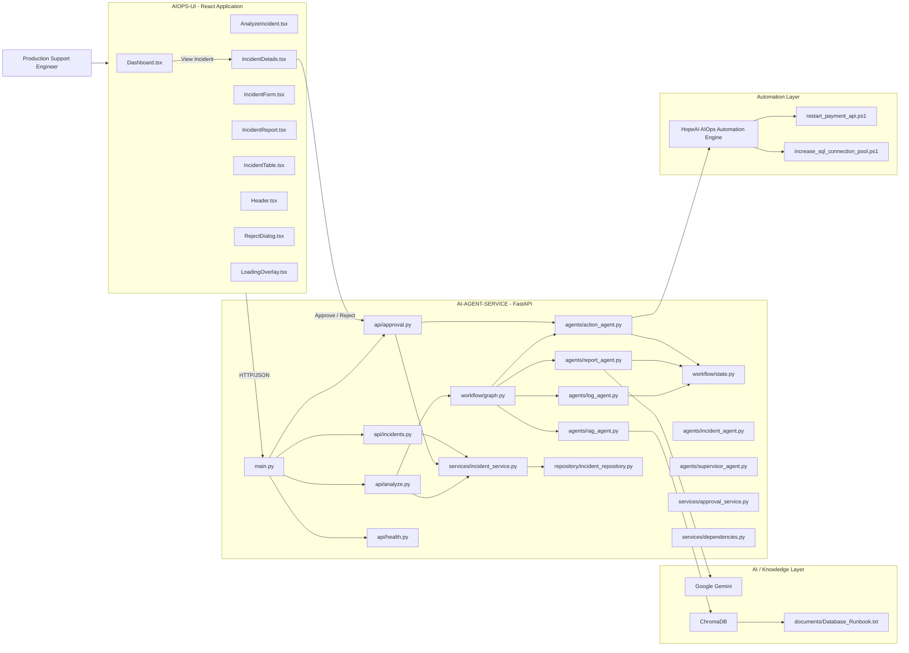

------------------------------------------------------------------------

# 3. Project Structure

## 3.1 Python Backend

``` text
AI-AGENT-SERVICE/
│
├── app/
│   │
│   ├── agents/
│   │   ├── __init__.py
│   │   ├── action_agent.py
│   │   ├── incident_agent.py
│   │   ├── log_agent.py
│   │   ├── rag_agent.py
│   │   ├── report_agent.py
│   │   └── supervisor_agent.py
│   │
│   ├── api/
│   │   ├── __init__.py
│   │   ├── analyze.py
│   │   ├── approval.py
│   │   ├── health.py
│   │   └── incidents.py
│   │
│   ├── models/
│   │   ├── requests.py
│   │   └── responses.py
│   │
│   ├── rag/
│   │   └── ...
│   │
│   ├── repository/
│   │   ├── __init__.py
│   │   └── incident_repository.py
│   │
│   ├── services/
│   │   ├── __init__.py
│   │   ├── approval_service.py
│   │   ├── dependencies.py
│   │   └── incident_service.py
│   │
│   └── workflow/
│       ├── __init__.py
│       ├── graph.py
│       └── state.py
│
├── chroma_db/
│   └── <Chroma collection data>
│
├── documents/
│   └── Database_Runbook.txt
│
├── scripts/
│   ├── restart_payment_api.ps1
│   └── increase_sql_connection_pool.ps1
│
├── .env
├── config.py
├── main.py
├── test_agent.py
├── test_rag.py
└── Test.ipynb
```

------------------------------------------------------------------------

## 3.2 React Frontend

``` text
AIOPS-UI/
│
├── public/
│
├── src/
│   │
│   ├── api/
│   │   └── api.ts
│   │
│   ├── assets/
│   │   └── hero.png
│   │
│   ├── components/
│   │   ├── DashboardCard.tsx
│   │   ├── Header.tsx
│   │   ├── IncidentForm.tsx
│   │   ├── IncidentReport.tsx
│   │   ├── IncidentTable.tsx
│   │   ├── LoadingOverlay.tsx
│   │   └── RejectDialog.tsx
│   │
│   ├── pages/
│   │   ├── AnalyzeIncident.tsx
│   │   ├── Dashboard.tsx
│   │   └── IncidentDetails.tsx
│   │
│   ├── services/
│   │   ├── approvalService.ts
│   │   ├── dashboardService.ts
│   │   ├── incidentDetailsService.ts
│   │   └── incidentService.ts
│   │
│   ├── theme/
│   │   └── darkTheme.ts
│   │
│   ├── types/
│   │   └── incident.ts
│   │
│   ├── App.tsx
│   └── main.tsx
│
├── index.html
├── package.json
├── tsconfig.json
└── vite.config.ts
```

------------------------------------------------------------------------

# 4. Application Layers

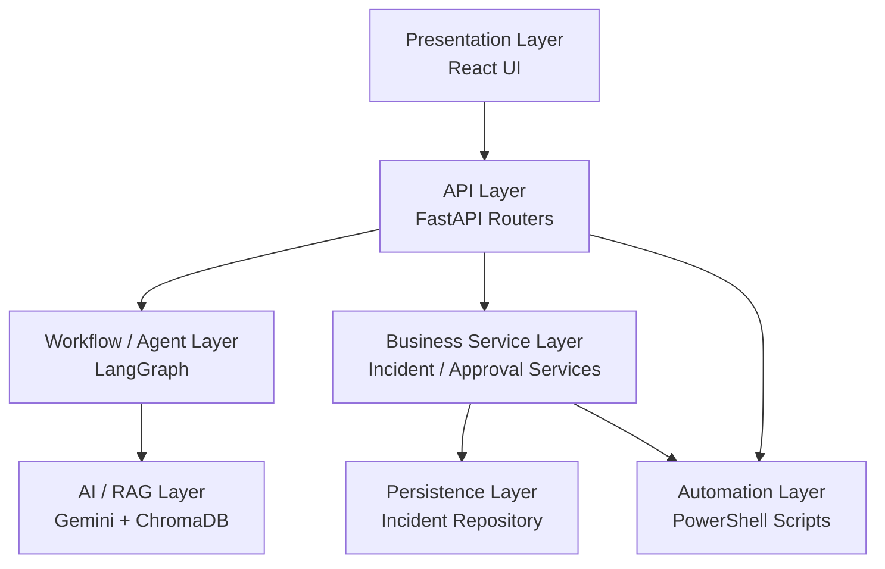

------------------------------------------------------------------------

# 5. Analyze Incident --- Complete Flow

When the user enters an incident log and clicks **Analyze Incident**,
the following flow occurs.

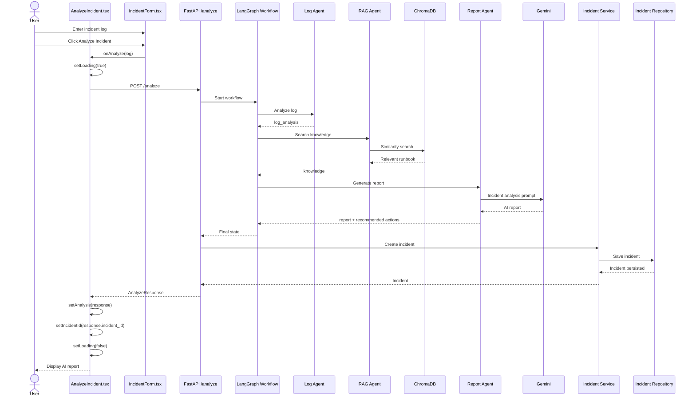

------------------------------------------------------------------------

# 6. Log Agent

File:

``` text
app/agents/log_agent.py
```

Responsibility:

-   Receive the original incident log.
-   Perform initial log analysis.
-   Identify information such as:
    -   detected issue
    -   severity
    -   category
-   Store the result in workflow state.

Conceptually:

``` text
Incident Log
     |
     v
+------------------+
|    Log Agent     |
+------------------+
     |
     v
log_analysis
```

The important design principle is that the original log should remain
available to later agents.

------------------------------------------------------------------------

# 7. RAG Agent

File:

``` text
app/agents/rag_agent.py
```

Knowledge source:

``` text
documents/
└── Database_Runbook.txt
```

Vector database:

``` text
chroma_db/
```

Flow:

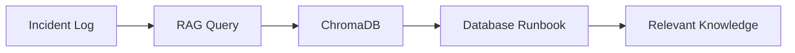

The RAG layer allows the system to use company-specific operational
knowledge rather than relying only on the LLM's general knowledge.

------------------------------------------------------------------------

# 8. Report Agent

File:

``` text
app/agents/report_agent.py
```

The Report Agent sends information to Gemini.

Conceptually:

``` text
Original Log
     +
Log Analysis
     +
Company Knowledge
     |
     v
+----------------+
|  Report Agent  |
+----------------+
     |
     v
+----------------+
| Gemini Model   |
+----------------+
     |
     v
AI Incident Report
```

The report contains:

``` text
Incident Summary

Severity

Affected Service

Root Cause

Recommended Resolution

Reference Documents
```

The recommended actions are then made available to the Action Agent and
UI.

------------------------------------------------------------------------

# 9. Workflow Architecture

File:

``` text
app/workflow/graph.py
```

State definition:

``` text
app/workflow/state.py
```

The workflow coordinates the agents.

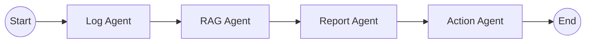

The workflow state acts as the shared context between agents.

Typical state information includes:

``` text
log
log_analysis
knowledge
report
recommended_actions
approval
execution_result
incident_id
```

------------------------------------------------------------------------

# 10. Incident Persistence

The application uses a service/repository pattern.

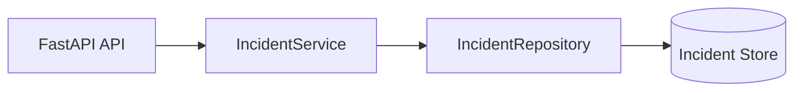

This separation is important because it allows the persistence
implementation to be changed later without changing the API or UI.

For example, the current repository can later be replaced with:

-   SQL Server
-   PostgreSQL
-   Amazon RDS
-   Azure SQL
-   MongoDB
-   another production database

without changing the React workflow.

------------------------------------------------------------------------

# 11. Incident Details Flow

The Dashboard contains the incident list.

The user selects **View Incident**.

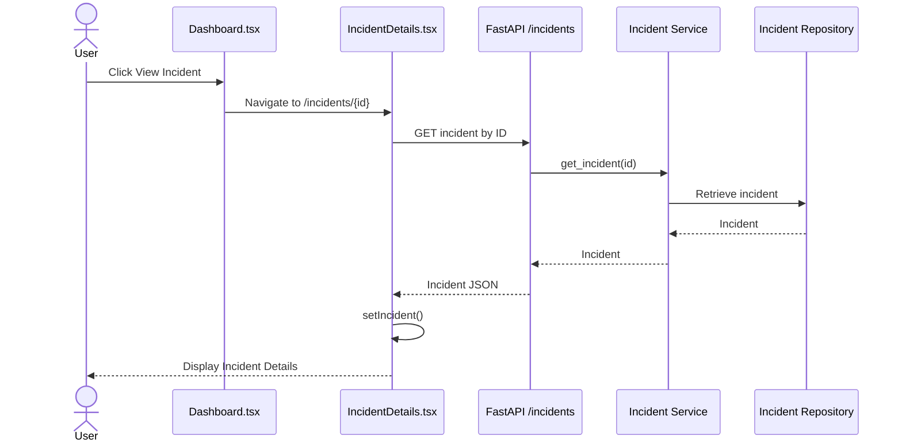

------------------------------------------------------------------------

# 12. Incident Status Lifecycle

The application currently uses three major business states.

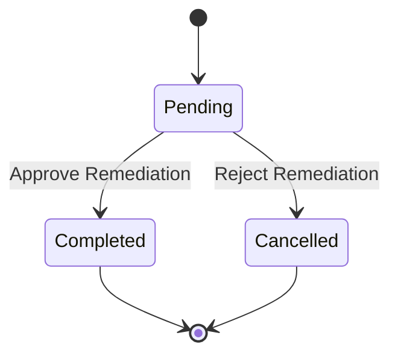

## Pending

Typical values:

``` text
approval = false
execution_result = null
```

The UI displays:

``` text
🟡 Pending
```

and shows:

``` text
Approve Remediation
Reject Remediation
```

------------------------------------------------------------------------

## Completed

Typical values:

``` text
approval = true
execution_result = automation output
```

The UI displays:

``` text
🟢 Completed
```

------------------------------------------------------------------------

## Cancelled

Typical values:

``` text
approval = false
execution_result = "User rejected remediation."
rejection_reason = <operator supplied reason>
```

The UI displays:

``` text
🔴 Cancelled
```

and displays the rejection reason.

------------------------------------------------------------------------

# 13. Approval Flow

When the user clicks:

``` text
Approve Remediation
```

the frontend calls:

``` text
POST /approve
```

with approximately:

``` json
{
  "incident_id": "incident-id",
  "approved": true
}
```

Flow:

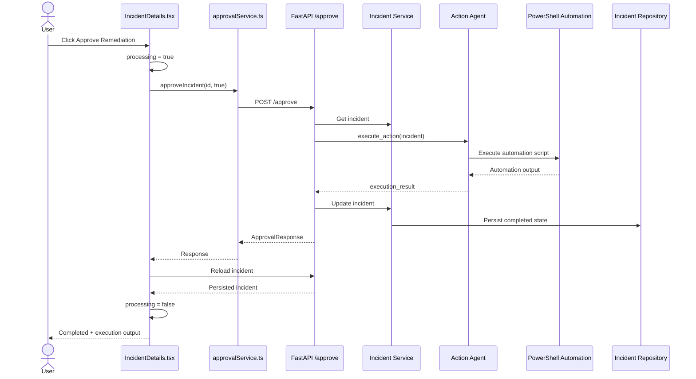

------------------------------------------------------------------------

# 14. Real Automation Layer

The system has moved beyond simulation and now executes real PowerShell
scripts.

Scripts:

``` text
scripts/
├── restart_payment_api.ps1
└── increase_sql_connection_pool.ps1
```

The Action Agent determines which automation should be executed based on
the recommended action.

------------------------------------------------------------------------

# 15. Payment API Restart Automation

Script:

``` text
scripts/restart_payment_api.ps1
```

Conceptual flow:

``` text
Recommended Action
        |
        v
"Restart Payment API Service"
        |
        v
Action Agent
        |
        v
restart_payment_api.ps1
        |
        +--> Restart Payment API
        |
        +--> Health Check
        |
        v
Automation Result
```

Example structured output:

``` text
=====================================
HopeAI AIOps Automation Engine
=====================================

Restarting Payment API...

Payment API restarted successfully.

Health Check : PASSED

Automation completed successfully.
```

------------------------------------------------------------------------

# 16. SQL Connection Pool Automation

Script:

``` text
scripts/increase_sql_connection_pool.ps1
```

Conceptual flow:

``` text
Recommended Action
        |
        v
"Increase SQL Connection Pool"
        |
        v
Action Agent
        |
        v
increase_sql_connection_pool.ps1
        |
        +--> Read current pool size
        |
        +--> Set new pool size
        |
        +--> Test DB connectivity
        |
        v
Automation Result
```

Example:

``` text
=====================================
HopeAI AIOps Automation Engine
=====================================

Increasing SQL Connection Pool...

Current Pool Size : 100

New Pool Size     : 200

Database connectivity verified.

Automation completed successfully.
```

------------------------------------------------------------------------

# 17. Reject Flow

Rejecting an incident is a human decision and does not execute
remediation.

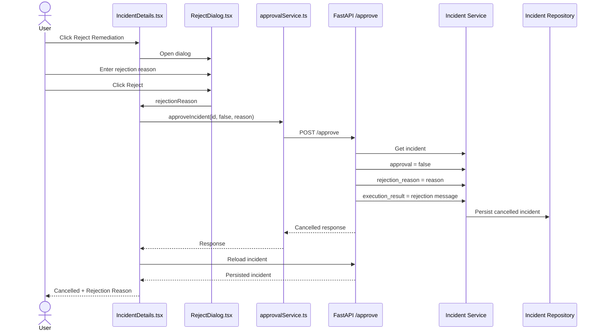

------------------------------------------------------------------------

# 18. Approval Request Model

File:

``` text
app/models/requests.py
```

Conceptually the approval request contains:

``` python
class ApprovalRequest(BaseModel):
    incident_id: str
    approved: bool
    reason: Optional[str] = None
```

The frontend sends the rejection reason when rejecting.

------------------------------------------------------------------------

# 19. Incident Model

File:

``` text
app/models/incident.py
```

Important fields include:

``` text
incident_id
created_at
log
report
recommended_actions
approval_required
approval
rejection_reason
execution_result
```

This model represents the incident lifecycle from analysis through
remediation.

------------------------------------------------------------------------

# 20. Frontend Service Layer

The React UI does not directly contain HTTP implementation inside every
page.

Instead, services provide a clean separation.

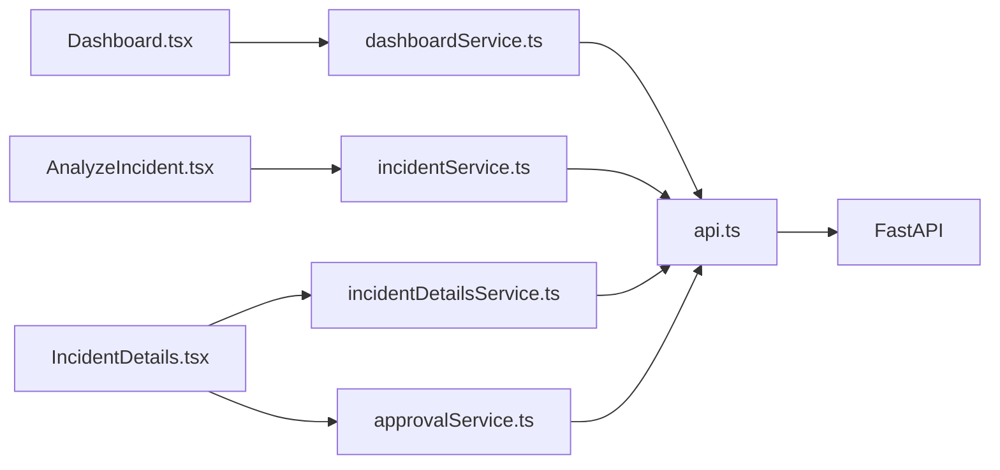

This makes the frontend easier to maintain and test.

------------------------------------------------------------------------

# 21. UI Component Architecture

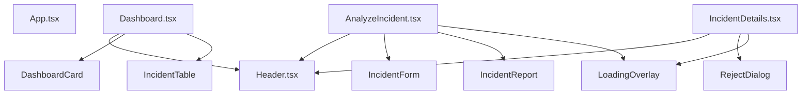

------------------------------------------------------------------------

# 22. Analyze Incident UI Flow

``` text
+-----------------------------+
|       Analyze Incident      |
+-----------------------------+
|                             |
| Incident Log                |
| -------------------------   |
| |                       |   |
| | Paste production log  |   |
| |                       |   |
| -------------------------   |
|                             |
| [ Analyze Incident ]        |
|                             |
+-----------------------------+

             |
             | Submit
             v

+-----------------------------+
|       LoadingOverlay        |
|                             |
|          (spinner)          |
|                             |
|     Analyzing incident...   |
+-----------------------------+

             |
             v

+-----------------------------+
|       AI Incident Report    |
+-----------------------------+
| Incident Summary            |
| Severity                    |
| Affected Service            |
| Root Cause                  |
| Recommended Resolution     |
| Reference Documents         |
+-----------------------------+

             |
             v

+-----------------------------+
| Incident created            |
|                             |
| [ View Incident ]           |
| [ Back to Dashboard ]       |
+-----------------------------+
```

------------------------------------------------------------------------

# 23. Incident Details UI

The Incident Details page contains:

``` text
Incident Details
│
├── Incident ID
├── Created
├── Status
├── Original Log
├── AI Incident Report
├── Recommended Actions
│
├── Approval Actions
│   ├── Approve Remediation
│   └── Reject Remediation
│
├── Rejection Reason
│
├── Execution Result
│
└── Back to Dashboard
```

------------------------------------------------------------------------

# 24. Loading / Processing Architecture

Component:

``` text
src/components/LoadingOverlay.tsx
```

The component uses Material UI:

``` text
Backdrop
    +
CircularProgress
    +
Typography
```

Approval processing:

``` text
Approve button
     |
     v
processing = true
     |
     v
LoadingOverlay
     |
     v
"Executing automation..."
     |
     v
POST /approve
     |
     v
Automation
     |
     v
Reload incident
     |
     v
processing = false
```

The same pattern can be used for incident analysis.

------------------------------------------------------------------------

# 25. Dashboard Architecture

The Dashboard is responsible for displaying:

-   Total incidents
-   Pending incidents
-   Completed incidents
-   Cancelled incidents
-   Incident table
-   View Incident action

Status counting logic conceptually is:

``` text
Total
  = all incidents

Pending
  = approval is false
    AND execution_result is null

Completed
  = approval is true

Cancelled
  = approval is false
    AND execution_result indicates rejection
```

This prevents cancelled incidents from being incorrectly counted as
pending.

------------------------------------------------------------------------

# 26. End-to-End Business Flow

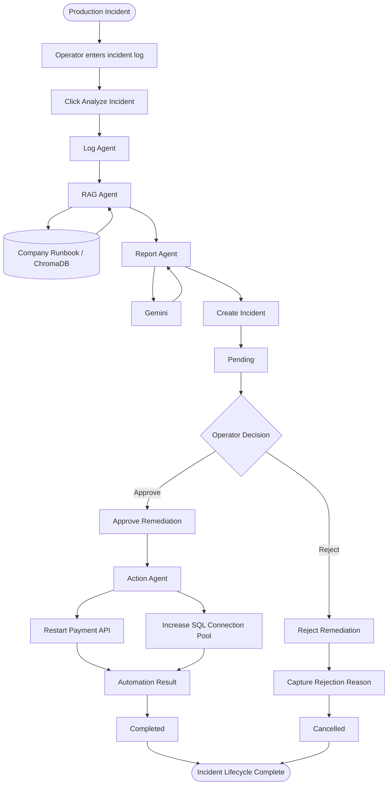

------------------------------------------------------------------------

# 27. Detailed Backend Request Flow

## Analyze

``` text
POST /analyze

        |
        v

api/analyze.py
        |
        v
workflow/graph.py
        |
        +--> log_agent.py
        |
        +--> rag_agent.py
        |
        +--> report_agent.py
        |
        +--> action_agent.py
        |
        v
incident_service.py
        |
        v
incident_repository.py
        |
        v
Incident persisted
        |
        v
AnalyzeResponse
```

## Approval

``` text
POST /approve

        |
        v

api/approval.py
        |
        v
incident_service.py
        |
        v
Decision
   /        \
Reject      Approve
  |            |
  v            v
Save reason   action_agent.py
  |            |
  v            v
Cancelled     PowerShell
               |
               v
           Execution result
               |
               v
           Save incident
               |
               v
            Completed
```

------------------------------------------------------------------------

# 28. API Responsibilities

## `main.py`

Application entry point.

Responsibilities:

-   Create FastAPI application.
-   Register API routers.
-   Configure middleware such as CORS.
-   Start the backend application.

------------------------------------------------------------------------

## `api/analyze.py`

Responsible for:

``` text
POST /analyze
```

Starts incident analysis and creates an incident.

------------------------------------------------------------------------

## `api/approval.py`

Responsible for:

``` text
POST /approve
```

Handles:

``` text
Approve
Reject
Rejection reason
Automation execution
Execution result
```

------------------------------------------------------------------------

## `api/incidents.py`

Responsible for incident retrieval.

Typical responsibility:

``` text
GET /incidents
GET /incidents/{incident_id}
```

------------------------------------------------------------------------

## `api/health.py`

Responsible for service health checking.

Typical endpoint:

``` text
GET /health
```

------------------------------------------------------------------------

# 29. Configuration

Files:

``` text
.env
config.py
```

The `.env` file stores environment-specific secrets/configuration such
as the Google API key.

Example:

``` text
GOOGLE_API_KEY=<secret>
```

`config.py` loads the environment configuration.

Important:

> `.env` must never be committed to source control.

The `.gitignore` file should contain:

``` text
.env
```

------------------------------------------------------------------------

# 30. Security Considerations

Before production deployment, the following should be implemented.

## API Authentication

The current local application can evolve to:

``` text
React
  |
  v
Authentication
  |
  v
FastAPI
```

Possible enterprise authentication:

-   Microsoft Entra ID
-   OAuth 2.0
-   JWT
-   API gateway authentication

## Automation Authorization

Automation actions should be protected by:

-   Role-based access control
-   Approval policy
-   Audit logging
-   Restricted service account
-   Script execution allow-list

## Secrets

Do not store:

``` text
API keys
database passwords
service credentials
tokens
```

inside source code.

Use:

-   Environment variables
-   Azure Key Vault
-   AWS Secrets Manager
-   HashiCorp Vault

------------------------------------------------------------------------

# 31. Recommended Production Architecture

The current local architecture can evolve into:

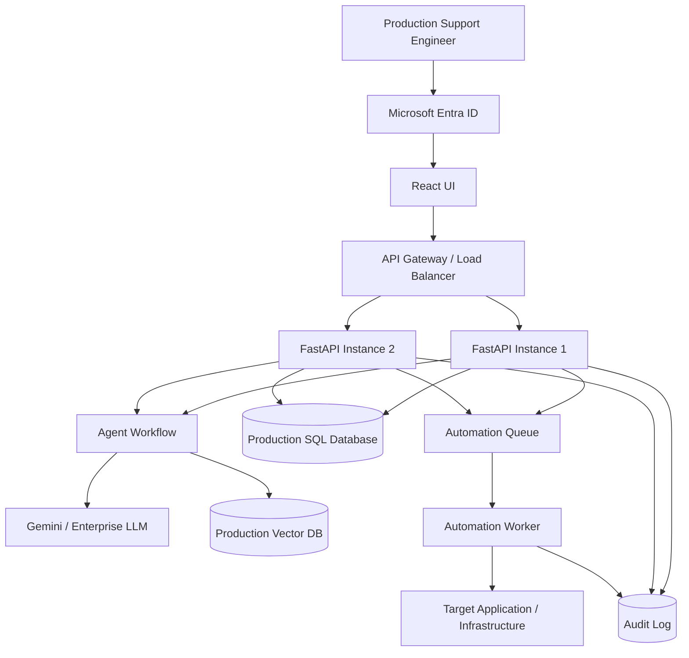

This architecture separates:

-   UI
-   API
-   AI reasoning
-   knowledge retrieval
-   persistence
-   automation execution
-   auditing

------------------------------------------------------------------------

# 32. Current vs Target Architecture

  -------------------------------------------------------------------------
  Area                    Current Implementation  Production Target
  ----------------------- ----------------------- -------------------------
  UI                      React/Vite              React + enterprise
                                                  authentication

  Backend                 FastAPI                 FastAPI behind API
                                                  Gateway

  AI                      Gemini                  Enterprise-approved LLM

  Workflow                LangGraph               LangGraph / managed
                                                  orchestration

  RAG                     ChromaDB                Managed vector database

  Incident Store          Repository              SQL Server/PostgreSQL/RDS
                          implementation          

  Automation              Local PowerShell        Dedicated automation
                                                  workers

  Authentication          Local                   Entra ID/OAuth

  Authorization           Basic approval          RBAC + policy

  Secrets                 `.env` locally          Key Vault/Secrets Manager

  Audit                   Basic incident data     Centralized audit logging

  Deployment              Local                   Docker/Kubernetes/Cloud

  Monitoring              Console/application     OpenTelemetry +
                          logs                    centralized monitoring
  -------------------------------------------------------------------------

------------------------------------------------------------------------

# 33. Important Design Principle

The most important architectural characteristic of HopeAI AIOps is that
the **LLM does not directly perform production changes**.

Instead:

``` text
LLM
 |
 | recommends
 v
Recommended Action
 |
 v
Human Approval
 |
 v
Action Agent
 |
 v
Approved Automation
 |
 v
PowerShell / Automation Worker
 |
 v
Target System
```

This is safer than allowing an LLM to execute arbitrary commands.

The recommended architecture is:

> **AI decides what should be done; deterministic automation decides how
> it is done.**

------------------------------------------------------------------------

# 34. Complete System Summary

``` text
                         HOPEAI AIOPS
                              |
          +-------------------+-------------------+
          |                                       |
          v                                       v
     React UI                               FastAPI Backend
          |                                       |
          |                               +-------+-------+
          |                               |               |
          v                               v               v
   Analyze Incident                  Analyze API     Approval API
          |                               |               |
          |                               v               v
          |                          LangGraph        Action Agent
          |                               |               |
          |                    +----------+----------+    |
          |                    |          |          |    |
          |                    v          v          v    v
          |                  Log        RAG       Report  Automation
          |                    |          |          |      |
          |                    |          v          v      |
          |                    |       Chroma      Gemini   |
          |                    |          |                 |
          |                    +----------+-----------------+
          |                               |
          |                               v
          |                         Incident Service
          |                               |
          |                               v
          |                        Incident Repository
          |                               |
          |                               v
          |                        Persisted Incident
          |
          +---------------------------------------------+
                                                        |
                                                        v
                                                 Incident Details
                                                        |
                                    +-------------------+------------------+
                                    |                                      |
                                    v                                      v
                              Approve                              Reject + Reason
                                    |                                      |
                                    v                                      v
                              Automation                            Cancelled
                                    |
                                    v
                              Execution Result
                                    |
                                    v
                                Completed
```

------------------------------------------------------------------------

# 35. Final End-to-End Flow

The complete HopeAI AIOps lifecycle is:

``` text
1. Operator receives production incident
              |
              v
2. Operator pastes logs into Analyze Incident
              |
              v
3. React sends POST /analyze
              |
              v
4. FastAPI starts LangGraph workflow
              |
              v
5. Log Agent analyzes the log
              |
              v
6. RAG Agent searches company runbooks
              |
              v
7. Report Agent sends contextual information to Gemini
              |
              v
8. AI report + recommended actions are generated
              |
              v
9. Incident is persisted
              |
              v
10. Incident becomes Pending
              |
              v
11. Operator opens Incident Details
              |
              +-----------------------------+
              |                             |
              v                             v
        Approve Remediation          Reject Remediation
              |                             |
              v                             v
        Action Agent                 Reject Dialog
              |                             |
              v                             v
       Deterministic script          Rejection Reason
              |                             |
              v                             v
       PowerShell Engine                Cancelled
              |
              v
       Automation Result
              |
              v
          Completed
              |
              v
12. UI reloads persisted incident
              |
              v
13. Dashboard reflects final state
```

------------------------------------------------------------------------

# 36. Key Files at a Glance

  --------------------------------------------------------------------------------------------
  Layer                   File                                         Responsibility
  ----------------------- -------------------------------------------- -----------------------
  Backend Entry           `main.py`                                    FastAPI application

  Analyze API             `app/api/analyze.py`                         Incident analysis
                                                                       endpoint

  Approval API            `app/api/approval.py`                        Approve/reject endpoint

  Incident API            `app/api/incidents.py`                       Incident retrieval

  Health API              `app/api/health.py`                          Health check

  Log Agent               `app/agents/log_agent.py`                    Log analysis

  RAG Agent               `app/agents/rag_agent.py`                    Knowledge retrieval

  Report Agent            `app/agents/report_agent.py`                 Gemini report
                                                                       generation

  Action Agent            `app/agents/action_agent.py`                 Automation execution

  Supervisor              `app/agents/supervisor_agent.py`             Agent
                                                                       coordination/control

  Workflow                `app/workflow/graph.py`                      LangGraph workflow

  State                   `app/workflow/state.py`                      Shared workflow state

  Incident Service        `app/services/incident_service.py`           Incident business logic

  Approval Service        `app/services/approval_service.py`           Approval-related logic

  Repository              `app/repository/incident_repository.py`      Incident persistence

  UI API                  `src/api/api.ts`                             Axios/API configuration

  Dashboard               `src/pages/Dashboard.tsx`                    Incident dashboard

  Analyze UI              `src/pages/AnalyzeIncident.tsx`              Incident analysis
                                                                       screen

  Details UI              `src/pages/IncidentDetails.tsx`              Approval and execution
                                                                       screen

  Incident Form           `src/components/IncidentForm.tsx`            Log input

  Report UI               `src/components/IncidentReport.tsx`          AI report display

  Reject Dialog           `src/components/RejectDialog.tsx`            Rejection reason

  Loader                  `src/components/LoadingOverlay.tsx`          Processing indicator

  Approval Client         `src/services/approvalService.ts`            Approval API calls

  Dashboard Client        `src/services/dashboardService.ts`           Dashboard API calls

  Incident Client         `src/services/incidentService.ts`            Analyze API calls

  Details Client          `src/services/incidentDetailsService.ts`     Incident detail API

  Restart Automation      `scripts/restart_payment_api.ps1`            Payment API restart

  SQL Automation          `scripts/increase_sql_connection_pool.ps1`   Pool-size automation

  Knowledge               `documents/Database_Runbook.txt`             Operational knowledge

  Vector Store            `chroma_db/`                                 RAG embeddings/data

  Config                  `.env`, `config.py`                          Environment
                                                                       configuration
  --------------------------------------------------------------------------------------------

------------------------------------------------------------------------

## 37. Architecture in One Sentence

> **HopeAI AIOps combines a React enterprise UI, FastAPI service layer,
> LangGraph multi-agent workflow, Gemini-powered reasoning,
> ChromaDB-based RAG, persistent incident management, human approval,
> and deterministic PowerShell automation to provide an end-to-end
> AI-assisted production incident remediation platform.**
